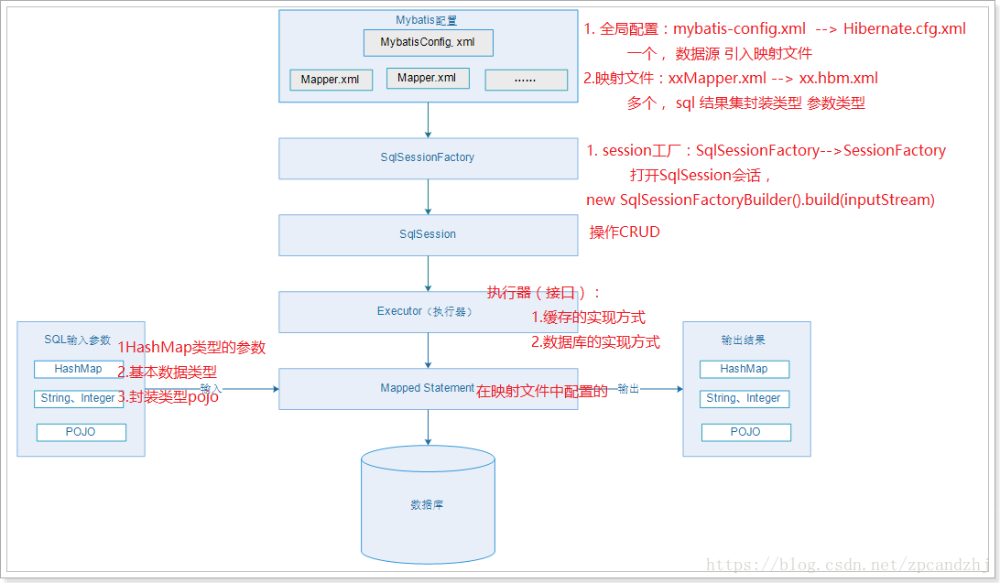

#### 引入依赖

```
<dependency>
    <groupId>org.mybatis</groupId>
    <artifactId>mybatis</artifactId>
    <version>3.2.8</version>
</dependency>
```

#### 全局配置文件(mybatis-config.xml)

```
<?xml version="1.0" encoding="UTF-8" ?>
<!DOCTYPE configuration
        PUBLIC "-//mybatis.org//DTD Config 3.0//EN"
        "http://mybatis.org/dtd/mybatis-3-config.dtd">
<!-- 根标签 -->
<configuration>
    <!-- 开启驼峰映射 ，为自定义的SQL语句服务-->
    <!--设置启用数据库字段下划线映射到java对象的驼峰式命名属性，默认为false-->
    <settings>
        <setting name="mapUnderscoreToCamelCase" value="true"/>
    </settings>
    <!-- 环境，可以配置多个，default：指定采用哪个环境 -->
    <environments default="test">

        <!-- id：唯一标识 -->
        <environment id="test">
            <!-- 事务管理器，JDBC类型的事务管理器 -->
            <transactionManager type="JDBC" />
            <!-- 数据源，池类型的数据源 -->
            <dataSource type="POOLED">
                <property name="driver" value="com.mysql.jdbc.Driver" />
                <property name="url" value="jdbc:mysql://127.0.0.1:3306/ssmdemo" />
                <property name="username" value="root" />
                <property name="password" value="your password" />
            </dataSource>

        </environment>
    </environments>
    <mappers>
        <mapper resource="mappers/MyMapper.xml" />
    </mappers>
</configuration>
```

#### 配置Map.xml(MyMapper.xml)

```
<?xml version="1.0" encoding="UTF-8" ?>
<!DOCTYPE mapper
        PUBLIC "-//mybatis.org//DTD Mapper 3.0//EN"
        "http://mybatis.org/dtd/mybatis-3-mapper.dtd">
<!-- mapper:根标签，namespace：命名空间，随便写，一般保证命名空间唯一 -->
<mapper namespace="MyMapper">
    <!-- statement，内容：sql语句。id：唯一标识，随便写，在同一个命名空间下保持唯一
       resultType：sql语句查询结果集的封装类型,tb_user即为数据库中的表
     -->
    <select id="selectUser" resultType="com.mybatis.User">
      select * from tb_user where id = #{id}
   </select>
</mapper>
```

#### 构建sqlSessionFactory(MybatisTest.java)

```
// 指定全局配置文件
        String resource = "mybatis-config.xml";
        // 读取配置文件
        InputStream inputStream = Resources.getResourceAsStream(resource);
        // 构建sqlSessionFactory
        SqlSessionFactory sqlSessionFactory = new SqlSessionFactoryBuilder().build(inputStream);
        // 获取sqlSession
        SqlSession sqlSession = sqlSessionFactory.openSession();
        try {
            // 操作CRUD，第一个参数：指定statement，规则：命名空间+“.”+statementId
            // 第二个参数：指定传入sql的参数：这里是用户id
            User user = sqlSession.selectOne("MyMapper.selectUser", 1);
            System.out.println(user);
        } finally {
            sqlSession.close();
        }
```

#### Mybatis使用步骤总结

```
1)配置mybatis-config.xml 全局的配置文件 (1、数据源，2、外部的mapper)
2)创建SqlSessionFactory
3)通过SqlSessionFactory创建SqlSession对象
4)通过SqlSession操作数据库 CRUD
5)调用session.commit()提交事务
6)调用session.close()关闭会话
```

#### parameterType和resultType

```
parameterType：指定输入参数类型，mybatis通过ognl从输入对象中获取参数值拼接在sql中。
resultType：指定输出结果类型，mybatis将sql查询结果的一行记录数据映射为resultType所指定类型的对象。如果有多条数据，则分别进行映射，并把对象放到容器List中
```

#### 动态代理

````
使用mapper接口不用写接口实现类即可完成数据库操作
使用mapper几口必须具备以下条件:
1)Mapper的namespace必须和mapper接口的全路径一致.
2)Mapper接口的方法名必须和sql定义的id一致
3)Mapper接口中方法的输入参数类型必须和sql定义的parameterType一致(不一定)
4)Mapper接口中方法的输出参数类型必须和sql定义的resultType一致.
````

#### ${} 与 #{}的区别

```
执行SQL：Select * from user where name = #{userName} 

参数：userName=>jack 

解析后执行的SQL：Select * from user where name = ？ 

执行SQL：Select * from user where name = ${userName} 

参数：userName传入值为：jack 

解析后执行的SQL：Select * from user where name = jack
```

