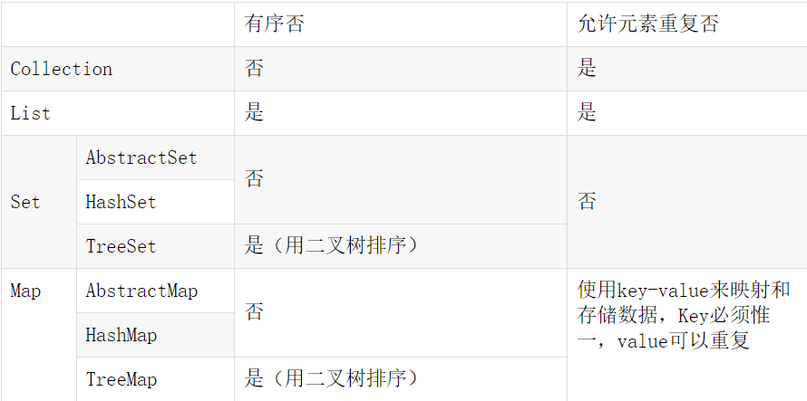

## 数据结构

### 栈

```
栈stack:[先进后出]
	又称堆栈,他是运算受限的线性表,其限制是仅允许在标的一端进行插入和删除操作,不允许在其他任何位置进行添加 查询 删除等操作,栈的入口和出口都是栈的顶端位置
压栈:就是存元素,把元素存储到栈的顶端位置,栈中已有元素依次向栈底方向移动一个位置.
弹栈:就是取元素,把栈的顶端位置元素取出,栈中已有元素依次向栈顶方向移动一个位置.
```

### 队列

```
队列queue:[先进先出]
	简称队,它同堆栈一样,也是一种运算受限的线性表,其限制是仅允许在表的一端进行插入,而在表的另一端进行删除.
	队列的入口和出口各占一侧.
```

### 数组

```
数组Array:[查询快,增删慢]
	是有序的元素序列,数组是在内存中开辟了一段连续的空间,并在此空间存放元素.
```

### 链表

```
链表Linked:[查询慢,增删快]
	由一系列节点node(链表中每一个元素称为一个节点)组成,节点可以在运行时动态生成,每一个节点包括两个部分,一个存储数据元素的数据域,另一个是存储下一个节点地址的指针域,链表结构单向链表和双向链表
[查询慢]:想查找某个元素,需要通过连接的节点,依次向后查找指定元素
[增删快]:想增加删除某个元素,只需要修改连接下一个元素的地址即可
```

### 二叉树

```
二叉树binary tree:
	是每个节点不超过2的有序数(tree)
	二叉树是每个节点最多有两个子数的数结构.
	顶上的叫根节点,两边被称为左子树和右子树.
```

```
红黑树是二叉树的一个特列:
	1.节点可以是红色的或者黑色的
	2.根节点是黑色的.
	3.叶子节点(特指空节点)是黑色的.
	4.每一个红色节点的子节点都是黑色的.
	5.任何一个节点到其每一个叶子节点的所有路径上黑色节点数相同
红黑树的特点:[速度特别快,趋近平衡树,查找叶子元素最少和最多次数不多于二倍]
```

```
数组(array)因为有序排列,查询快,增删慢

链表(linked)因为存储着当前节点数据和下一个节点的地址,所以查询慢,增删快
```


```
List数据可重复,set数据不可重复
```




#### List总结

- 1.所有的List中只能容纳单个不同类型的对象组成的表,而不是key-value键值对

- 2.所有的List中可以有相同的元素

- 3.所有的List中可以有null元素

- 4.基于Array的List(Vector,ArrayList)适合查询,而LinkedList(链表)适合添加删除等操作

  ```
  ArrayList先进先出 数据怎么存,取出来的顺序就是怎样
  LinkedList先进先出 数据怎么存,取出来的顺序就是怎样
  ```
  
  

#### Set总结

- 1.Set实现的基础是Map(HashMap)

- 2.Set中的元素是不能重复的,如果使用add方法添加已经存在的对象,则会覆盖前面的对象

  ```
          |——SortedSet接口——TreeSet实现类
  
  Set接口——|——HashSet实现类                
  
          |——LinkedHashSet实现类
          
  HashSet不能保证元素的排列顺序，顺序有可能发生变化,集合元素可以是null,但只能放入一个null,存储时,先判断两个对象的hashCode()方法返回值是否相等,不相等则说明两个对象不相等,根据hashCode值来决定存储位置,相等则调用equlas方法判断是否相等.
  
  TreeSet是SortedSet接口的唯一实现类，TreeSet可以确保集合元素处于排序状态。支持两种排序方式，自然排序 和定制排序，其中自然排序为默认的排序方式。向  TreeSet中加入的应该是同一个类的对象,TreeSet判断两个对象不相等的方式是两个对象通过equals方法返回false，或者通过CompareTo方法比较没有返回0.
  	* 当compareTo方法返回0的时候集合中只有一个元素
  	* 当compareTo方法返回正数的时候集合会怎么存就怎么取
  	* 当compareTo方法返回负数的时候集合会倒序存储
  
  LinkedHashSet会保证元素的添加顺序.底层是链表实现的,是set集合中唯一一个能保证怎么存就怎么取的集合对象，因为是HashSet的子类,所以也是保证元素唯一的,与HashSet的原理一样。
  ```


#### Map总结

Map.Entry 是Map中的一个接抄口，他的用途是表示一个映射项（里面有Key和Value），而Set<Map.Entry<K,V>>表示一个映射项的Set。

Map.Entry里有相应的getKey和getValue方法，即JavaBean，让我们能够从一个项中取出Key和Value。

遍历方式

- 1

```
Map<Integer,String> map = new HashMap<>();
        map.put(1,"a");
        map.put(2,"b");
        map.put(3,"c");
        map.put(4,"d");
        map.put(5,"e");
        for(Map.Entry<Integer,String> entry:map.entrySet()){
            System.out.println(entry.getValue());
        }
```


- 2

```
for(String value:map.values()){
            System.out.println(value);
        }
for(String key:map.keySet()){
            System.out.println(keySet);
        }
```

- 3

```
Iterator<Map.Entry<Integer,String>> iterator = map.entrySet().iterator();
        while(iterator.hasNext()){
            Map.Entry<Integer,String> entry = iterator.next();
            System.out.println(entry.getValue());
        }
```

- 4 (不推荐)

```
for(Integer key : map.keySet()){
            Object value = map.get(key);
            System.out.println(value);
        }
```

- 5

```
for(String value : map.values()){
            System.out.println(value);
        }
```

